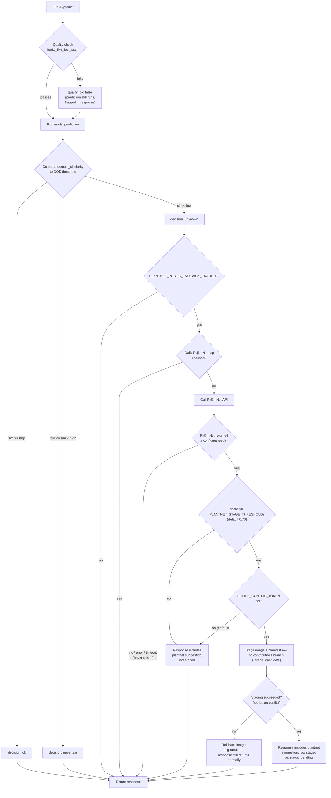

# Architecture

## Overview

Plantify is an ML project, organized so each trained capability is reachable
through the same three layers:

1. **Training pipeline** (`src/plantify/`) — builds the model and its
   evaluation artifacts.
2. **FastAPI service** (`api/`) — exposes the model over HTTP.
3. **`web/` showcase frontend** — calls the API and renders the result. It
   has no ML logic; it's a demo/integration surface, not the project.

There's also a Streamlit app (`app.py`) used internally for interactive
predictions and the retrain/teaching loop — a developer tool, not the public
surface.

Today there's one trained capability (leaf species identification). The
layering exists specifically so a second one doesn't require restructuring
anything — see [Adding a new ML capability](#adding-a-new-ml-capability).

## Runtime Components

- `src/plantify/streamlit_app.py`: UI, prediction funnel, OOD checks, retrain trigger.
- `src/plantify/training.py`: dataset split, feature extraction, head training, metrics export.
- `src/plantify/data.py`: class mapping and contribution persistence helpers.
- `src/plantify/plantnet_client.py`: optional Pl@ntNet second-opinion fallback.
- `api/main.py`: REST interface (`/health`, `/predict`) for external consumers.

## Data and Model Flow

1. Data is read from `data/<class-folder>/`.
2. Training script extracts MobileNetV2 embeddings and trains a classification head.
3. Outputs are saved to `artifacts/`:
   - `artifacts/model/`
   - `artifacts/class_labels.json`
   - `artifacts/ood.npz`
   - `artifacts/reports/` charts and metrics
4. Inference path loads model + labels + OOD references and returns prediction decision.

## Decision Funnel

1. Validate upload quality (`looks_like_leaf_scan`).
2. Run model prediction.
3. Compare embedding similarity against OOD threshold.
4. Return one of: `ok`, `uncertain`, `unknown`.
5. Optional: ask Pl@ntNet for external fallback.

## Adding a new ML capability

Identification (`/predict` → `identify.html`) is the reference pattern for
every layer a new ML feature needs:

1. **Train** — add the model/pipeline under `src/plantify/` (a new module,
   following `training.py`'s shape: data in, artifacts out under a clearly
   named subdirectory of `artifacts/`). Export whatever the API needs to load
   (model weights, label list, any thresholding data).
2. **Serve** — add an endpoint to `api/main.py` (e.g. `POST /predict-disease`)
   that loads the model once at startup (see `_load_once()`) and returns a
   JSON payload with a clear status/decision field, the same way `/predict`
   returns `decision: ok | uncertain | unknown`. Don't guess confidently on
   bad input — every capability should have some honesty mechanism, even a
   simple confidence floor.
3. **Show** — add a `web/<feature>.html` + `web/js/<feature>.js`, copying
   `identify.html`/`identify.js`'s structure: it loads `js/config.js` for
   `window.PLANTIFY_API_BASE`, then a `fetch()` call, and result states that
   map 1:1 to whatever your endpoint's decision/status values are. Add it to
   the nav and to the "ML Capabilities" grid on `index.html`.
4. **Document** — add the new endpoint's contract to `docs/INTEGRATION.md`
   next to `/predict`'s.

Nothing about this requires touching the other capabilities — the API and
the web pages are one-to-one with each trained model.

## Active Learning & Self-Retraining

When `/predict` returns `unknown`, the API can optionally consult Pl@ntNet
and use a confident answer to grow the training set — fully automated, no
human in the loop for staging (though a regression gate still guards what
ever reaches the committed model). This is off by default; every piece below
requires explicit configuration to activate.

The pipeline is split into two workflows with different cadences and
purposes, on purpose: **gathering data is cheap and runs daily; training a
model is comparatively expensive and runs weekly**, once on however much
accumulated that week. This mirrors how `scripts/fetch_full_dataset.py`
originally bootstrapped the initial 15 species — fetching and training were
always two different concerns, they just used to happen in the same job.

**Per-request (`api/main.py`):**
1. `unknown` only — not `uncertain`, which already has a plausible model
   guess. Gated by `PLANTNET_PUBLIC_FALLBACK_ENABLED` (default off).
2. Rate-limited to `PLANTNET_DAILY_CAP` (default 300) Pl@ntNet calls/day,
   shared quota with the Streamlit tool's manual "Ask Pl@ntNet".
3. If Pl@ntNet's top result scores `>= PLANTNET_STAGE_THRESHOLD` (default
   0.70), the image + a manifest row are staged via the GitHub Contents API
   to a dedicated **`contributions` branch** (never `main` — caps blast
   radius if the write-scoped token in `GITHUB_CONTRIB_TOKEN` ever leaks).
   Staging is best-effort and rolls back the image if the manifest write
   ultimately fails (`_stage_candidate`, with retry-on-conflict).

Nothing here writes to the API's local disk — an ephemeral host's filesystem
doesn't survive a restart, so GitHub itself is the only durable store.

**Staging format:** `data_pending/manifest.jsonl` (append-only, one JSON
object per line — avoids read-modify-write races on a parsed array) +
`data_pending/images/<uuid>.<ext>`. Row `status` moves
`pending → promoted_pending_gate → accepted_committed` (or back to `pending`
with a `reject_reason` if the gate later rejects the retrain) — never
deleted, so the full history of every candidate is auditable.
See `src/plantify/data.py`'s `build_pending_row`/`append_pending`/
`read_pending`/`write_pending`. This is a separate, *unverified* path from
`save_contribution` — the trusted, human-confirmed one used by Streamlit's
"Teach the model".

### Daily: gather (`.github/workflows/daily-gather.yml`)

Never loads TensorFlow or touches the model — this workflow is cheap by
construction, so it doesn't need a cost-avoidance check the way training
does. Nothing here ever touches `main`.

1. **If there's real pending data:** `scripts/promote_pending.py` — re-checks
   the score threshold, maps Pl@ntNet's scientific name onto an existing
   class by genus, caps promotions at `--max-per-class` per cycle, copies
   accepted images into `data/<species>/`. Guesses that don't genus-match
   any existing class are never silently discarded — see "Growing to new
   species" below.
2. **If there's no real pending data:** self-sourced reinforcement fills the
   gap instead of the day going by with nothing happening.
   `scripts/fetch_species_dataset.py` fetches a small batch
   (`REINFORCEMENT_FETCH_COUNT`, default 5) of real, licensed images from
   [GBIF](https://www.gbif.org/) for one existing species, chosen by a
   deterministic daily rotation (`day_of_year % 15`) so every class gets
   refreshed periodically.
3. New-species growth (Path A candidate list, Path B visitor trigger — see
   below) also runs here, capped at one species per day.
4. Whatever was gathered is **staged on the `contributions` branch** — the
   same non-default branch real user candidates already use — under
   `data_pending/staged/<species-folder>/...` (mirroring `data/`'s own
   layout) and `data_pending/staged_candidates.txt`. Never `main`. Each
   run starts by overlaying whatever's already staged there onto the local
   `data/` working copy first, so `ATTRIBUTION.md` appends and candidate-list
   "done" markers correctly build on earlier-this-week entries, not just
   what's already on `main`.

### Weekly: train (`.github/workflows/weekly-retrain.yml`, Mondays + manual dispatch)

1. A cheap check: is there anything actually staged on `contributions`?
   Reading that worktree is nearly free; loading TensorFlow for a baseline
   eval is not. `daily-gather.yml` runs every day but often stages nothing
   (e.g. GBIF had nothing for that day's rotation species) — no need to pay
   for a retrain over an empty staging area. This is what keeps weekly
   training from reproducing the original "retrain even when nothing's new"
   waste, now that gathering happens daily.
2. If something is staged: merge it onto the local `data/` working copy
   (still nothing committed to `main` yet — just this job's local checkout),
   evaluate the currently committed model (`scripts/evaluate_model.py`) →
   baseline, retrain (`scripts/train_model.py`, unchanged) on the merged
   `data/`, evaluate the result, and run the **regression gate**
   (`scripts/regression_gate.py`): accept only if aggregate accuracy is
   within `--tolerance` (1%) of baseline, no single existing class's recall
   has *significantly* regressed, and any freshly-introduced class clears an
   absolute recall floor (`NEW_SPECIES_MIN_RECALL`, default 0.60).

   Per-class regression uses a one-sided two-proportion significance test
   (`--significance`, default p < 0.05) over each class's raw correct/total
   counts (`per_class_support` in the metrics JSON) when both the baseline
   and new eval have them, falling back to a flat `--per-class-tolerance`
   (8%) otherwise. This exists because with only ~15 test images per class, a
   single flipped prediction swings that class's raw recall ~6.7% on its own
   — a flat tolerance can't tell that apart from a real regression no matter
   how it's tuned, but a significance test can, since it accounts for how
   much evidence actually exists for that class instead of using one fixed
   number for all of them. (Confirmed live: the one-flipped-image-out-of-15
   shape that used to reject every time — see Issue #18 — is no longer
   statistically distinguishable from noise and is now accepted, while a
   real multi-image regression at the same sample size is still caught.)
3. Accepted → opens or updates **one pull request per calendar month**
   (`artifacts/`, `data/` — now including this week's merged staged
   additions — and the manifest, on an `auto-retrain/YYYY-MM` branch), body
   includes the before/after accuracy and gate result, then clears the
   now-merged files from `contributions`'s staging area so next week doesn't
   re-process them. A second accepted retrain within the same month
   force-pushes a fresh commit onto that same branch/PR (with a comment
   recording that week's numbers) instead of opening a new one; a new
   calendar month starts a fresh branch/PR. **Never auto-merges** — every
   accepted retrain always waits for manual review and merge, regardless of
   whether a new species was introduced. Commits are authored as
   `github-actions[bot]` — **never the human maintainer's identity**; an
   automated change must say so honestly, not be styled to look like manual
   work.
   Rejected → **`main` is never touched** (exactly like the pipeline's
   original, single-workflow design) — no PR, an issue is opened recording
   why, promoted manifest rows revert to `pending`, and the staged data
   itself is deliberately left in place on `contributions` (not cleared),
   ready for an automatic retry next week or a manual prune if the
   rejection reason points at a specific species.

```mermaid
flowchart TD
    subgraph daily ["daily-gather.yml — every day, 06:00 UTC"]
        DStart(["Cron or workflow_dispatch"]) --> DCheckout["Checkout main +<br/>set up contributions worktree,<br/>overlay this week's staged<br/>data/ additions (if any)"]
        DCheckout --> DCheapCheck{"Any real status: pending<br/>rows in the manifest?"}

        DCheapCheck -->|"yes"| Promote["promote_pending.py"]
        Promote --> PromoteOutcome{"Per row: score ok,<br/>genus match,<br/>under cap,<br/>path inside data_pending/images/,<br/>file exists?"}
        PromoteOutcome -->|"all pass"| PromoteOK["Copy into data/species/<br/>status: promoted_pending_gate"]
        PromoteOutcome -->|"no genus match<br/>(score still ok)"| StampGroup["Stamp new_species_group,<br/>status: rejected"]
        PromoteOutcome -->|"any other check fails"| RejOther["status: rejected<br/>(below_score_threshold /<br/>per_class_cap_reached /<br/>invalid_image_path /<br/>image_missing)"]

        StampGroup --> TriggerScan["Re-scan ALL rows (any day)<br/>carrying new_species_group"]
        TriggerScan --> TriggerCheck{"Enough signals across<br/>enough distinct days?<br/>(Path B threshold)"}
        TriggerCheck -->|"yes"| TriggerFire["Mark rows trigger_fired,<br/>new_species_ready = true"]
        TriggerCheck -->|"not yet"| TriggerWait["Rows stay rejected,<br/>re-counted tomorrow"]

        DCheapCheck -->|"no"| Rotation["Pick rotation species<br/>(day_of_year mod 15)"]
        Rotation --> Reinforce["fetch_species_dataset.py<br/>--count 5 --min-fetched 1<br/>(GBIF, existing class only)"]
        Reinforce --> ReinforceOutcome{"Fetched >= 1<br/>licensed image?"}
        ReinforceOutcome -->|"no"| ReinforceFail["continue-on-error,<br/>no images added"]
        ReinforceOutcome -->|"yes"| ReinforceOK["Images + ATTRIBUTION.md<br/>added to existing<br/>data/species/"]

        PromoteOK --> NSCheck
        TriggerFire --> NSCheck
        TriggerWait --> NSCheck
        RejOther --> NSCheck
        ReinforceOK --> NSCheck
        ReinforceFail --> NSCheck

        NSCheck{"Path B ready<br/>today?"} -->|"yes"| FetchB["fetch_species_dataset.py<br/>--species (trigger name)<br/>--count 30"]
        NSCheck -->|"no"| PathACheck{"Path A: unprocessed line<br/>in new_species_candidates.txt?"}
        PathACheck -->|"yes"| FetchA["fetch_species_dataset.py<br/>--candidate-list --count 30"]
        PathACheck -->|"no"| NoNewSpecies["No new species today"]

        FetchB --> FetchBOutcome{"Fetched >= NEW_SPECIES_MIN_FETCHED?"}
        FetchBOutcome -->|"no"| FetchBFail["Failure — trigger stays<br/>fired, retried tomorrow"]
        FetchBOutcome -->|"yes"| NewClassB["New class folder + ATTRIBUTION.md"]

        FetchA --> FetchAOutcome{"Fetched >= NEW_SPECIES_MIN_FETCHED?"}
        FetchAOutcome -->|"no"| FetchAFail["Candidate marked done anyway —<br/>one retry attempt only"]
        FetchAOutcome -->|"yes"| NewClassA["New class folder + ATTRIBUTION.md,<br/>candidate line marked done"]

        NewClassB --> DStage
        NewClassA --> DStage
        FetchBFail --> DStage
        FetchAFail --> DStage
        NoNewSpecies --> DStage

        DStage(["Stage new/changed data/ files to<br/>contributions branch<br/>(data_pending/staged/) —<br/>main is never touched here"])
    end

    DStage -.->|"accumulates over<br/>the week"| WStart

    subgraph weekly ["weekly-retrain.yml — Mondays, 07:00 UTC"]
        WStart(["Cron or workflow_dispatch"]) --> WCheckout["Checkout main +<br/>set up contributions worktree,<br/>merge staged data/ onto local<br/>working copy (still not on main)"]
        WCheckout --> WCheapCheck{"Anything staged on<br/>contributions?"}
        WCheapCheck -->|"no"| WNoOp(["Log 'nothing to train on<br/>this week', exit"])

        WCheapCheck -->|"yes"| Baseline["Evaluate current model<br/>(baseline)"]
        Baseline --> Retrain["Retrain on the merged,<br/>week-accumulated data/"]
        Retrain --> Eval2["Evaluate retrained model"]
        Eval2 --> GateAgg{"Aggregate accuracy<br/>within tolerance?"}
        GateAgg -->|"no"| GateReject["Gate REJECTED"]
        GateAgg -->|"yes"| GatePerClass{"Any EXISTING class's<br/>recall regressed?"}
        GatePerClass -->|"yes"| GateReject
        GatePerClass -->|"no"| GateNewFloor{"Any NEW class below the<br/>0.60 recall floor?"}
        GateNewFloor -->|"yes"| GateReject
        GateNewFloor -->|"no"| GateAccept["Gate ACCEPTED"]

        GateReject --> RevertRows["Revert promoted/trigger_fired<br/>manifest rows to pending.<br/>main untouched; staged data/<br/>left in place on contributions<br/>for retry or manual prune"]
        RevertRows --> OpenIssue(["Open GitHub issue<br/>recording the rejection"])

        GateAccept --> FinalizeRows["Finalize manifest rows to<br/>accepted_committed"]
        FinalizeRows --> OpenPR["Open or update this month's PR<br/>(auto-retrain/YYYY-MM,<br/>artifacts/ + data/)<br/>github-actions[bot] authored"]
        OpenPR --> ClearStaged["Clear staged data from<br/>contributions — now safely<br/>part of the PR"]
        ClearStaged --> FlagReview(["PR left open —<br/>never auto-merged,<br/>always waits for<br/>manual review"])
    end
```

### Growing to new species

Species outside the current 15 are never added from a single unverified
Pl@ntNet guess. Two parallel paths feed into the same fetch mechanism
(`fetch_species_dataset.py`) and the same safety net — at most **one** new
species is processed per day, to keep review load manageable:

- **Path A — maintainer-curated candidate list**
  (`scripts/new_species_candidates.txt`): a plain text file, one scientific
  name per line, edited by hand any time. Each day, if the day's "one new
  species" budget hasn't been spent, the first unprocessed line is fetched
  from GBIF and marked done (or left for a future retry if GBIF didn't have
  enough licensed images). This is what lets the model grow to new species
  without depending on any visitor traffic at all.
- **Path B — visitor-driven Pl@ntNet signal**: `promote_pending.py` stamps
  a `new_species_group` field (the exact, lowercased Pl@ntNet scientific
  name) onto rows that pass the score threshold but don't genus-match any
  known class, instead of discarding them. Once a species accumulates
  `NEW_SPECIES_TRIGGER_MIN_SIGNALS` (default 3) independent guesses across
  `NEW_SPECIES_TRIGGER_MIN_DIVERSITY_DAYS` (default 2) distinct days, that's
  reported as a trigger and the same GBIF fetch fires for it. These photos
  are only ever a *trigger signal* now, never the actual training data. If
  both paths are ready the same day, Path B takes priority — real user
  signal is stronger evidence than a maintainer's guess.

`fetch_species_dataset.py` queries GBIF's public occurrence API, keeps only
permissively-licensed media (CC0/CC-BY/CC-BY-SA — excludes NC/ND by default,
matching this repo's own MIT/fully-open stance), downloads and downsizes the
images the same way `fetch_full_dataset.py` originally bootstrapped the
initial 15 species, and writes `data/<folder>/ATTRIBUTION.md` (creator,
license, source link per image — required for CC-BY/CC-BY-SA compliance).

**Known limitations, stated honestly rather than papered over:**

- **Domain mismatch.** The existing 15 classes are trained on clean,
  single-leaf, near-white-background studio scans. GBIF/iNaturalist photos
  are typically field/habit shots — different backgrounds, lighting, and
  framing. This affects both self-sourced reinforcement and new species.
  `fetch_species_dataset.py` makes no attempt to correct for this beyond
  GBIF's own metadata; the real protection is the regression gate (for
  reinforcement, recall can't drop) and mandatory human review (for new
  species) — not a claim that the mismatch is solved.
- **Some species names GBIF can't resolve at all.** `_search_media()` first
  tries the full scientific name, then (`_base_binomial_fallback()`) retries
  with just genus + species epithet if the full name had a cultivar/variety
  qualifier (e.g. `"Salix alba 'Sericea"` → `"Salix alba"`). This helps
  common cases, but confirmed live against GBIF's API: `"Salix alba"` itself
  is ambiguous in GBIF's backbone taxonomy (`/species/match` returns
  `matchType: "NONE"`, `"Multiple equal matches for Salix alba"`) — its
  occurrence search returns zero results no matter how the name is
  formatted. This is a genuine GBIF data-resolution gap, not a bug in this
  script; for such species (leaf7, `"Salix alba 'Sericea"`, is a concrete
  example already in this dataset), self-sourced reinforcement will
  reliably find nothing and the class can only grow via real visitor
  uploads through the Pl@ntNet path, which doesn't depend on exact-name
  GBIF resolution.
- **Diversity heuristic is a proxy, not a guarantee.** The live API has no
  user/session identity, so Path B's "diverse enough" check is just
  timestamp day-bucketing. A sufficiently patient actor spreading requests
  across several days could still eventually trigger accumulation — but
  Pl@ntNet must independently agree at `>= 0.70` confidence each time (an
  external signal not directly controlled by the requester), and the
  mandatory human-merge gate on the resulting PR is the actual backstop,
  not this heuristic.
- **PR-reject "flicker".** Manifest rows reach `accepted_committed` once the
  regression gate accepts, which happens *before* a human actually merges
  the PR. If a maintainer rejects a new-species PR instead of merging it,
  the corresponding rows need a manual revert to `"pending"` on the
  `contributions` branch — not automated today.
- **Daily-gather's staging step isn't itself transactional.** `daily-gather.yml`
  detects "what changed under `data/` this run" via `git status --porcelain`
  and copies those files to the `contributions` staging area in a separate
  step from the fetch itself. If the job were killed between a successful
  fetch and that copy (rare — GitHub Actions runners don't typically die
  mid-step), the fetched images would be lost rather than staged, and
  silently re-attempted the next day (rotation moves on; Path A/B would
  simply retry). Not data corruption, just a small, bounded chance of a
  wasted fetch — not worth building retry/transaction logic around for how
  rarely a runner actually dies mid-job.

## Compatibility Layer

`app.py` is retained at root as a wrapper around `src/plantify/streamlit_app.py` because Streamlit Community Cloud deploys expect a root-level main file (see `DEPLOY.md`). Training and utility code live solely in `src/plantify/` and `scripts/` — there are no other root-level wrapper files.
